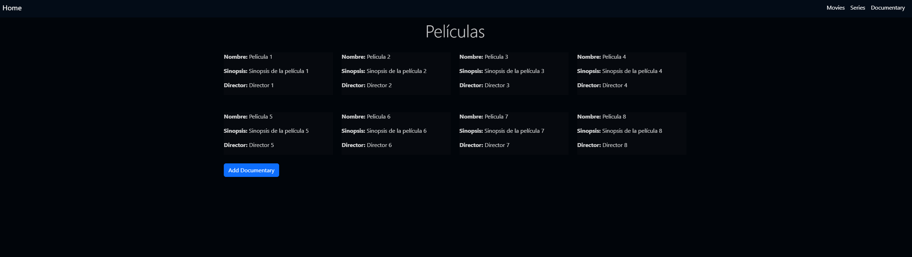

# Movies_Series_Documentary

una sensilla pagina creada en ROR para poder mostrar información de una base de datos

## Descripción

la pagina mostrara los datos de una base de datos en donde existen tres tablas, se aplica la verificación de datos a su vez

## Visuales



## Empezando 🚀

Estas instrucciones te guiarán para obtener una copia de este proyecto en funcionamiento en tu máquina local para propósitos de desarrollo y pruebas.

### Prerrequisitos 📋

Lista de software y herramientas, incluyendo versiones, que necesitas para instalar y ejecutar este proyecto:

- Sistema Operativo windows, ubuntu o mac
- Lenguaje de programación Ruby 3.2.2
- Framework Rails 7.0.6
- Postgrestql 14.8

### Instalación 🔧

Clona el repositorio con el siguiente comando

```bash
git clone https://github.com/Delky91/movies_layout_rails
```

En la terminal accede a la carpeta donde esta el repositorio y ejecuta
(recuerda que para que esto funcione debes tener instalado ruby y la gema bundle)

```bash
bundle install
```

Inicia la base de datos con el siguiente comando

```bash
rails db:create db:migrate
```

Finalmente ejecuta el proyecto con el siguiente comando y ve a la ip que saldra en la consola

```bash
rails s
```

## Construido Con 🛠️

Explica qué tecnologías usaste para construir este proyecto. Aquí algunos ejemplos:

- [Ruby](https://www.ruby-lang.org/es/) - El lenguaje utilizado
- [Ruby on Rails](https://rubyonrails.org) - El framework web utilizado
- [Ruby gems](https://rubygems.org) - Gestión de dependencias

## Soporte

Si tienes algún problema o sugerencia, por favor abre un problema [aquí](https://github.com/Delky91/movies_layout_rails/issues).

## Autores ✒️

- **Luis Miño Bustos** - _Trabajo inicial_ - [Luis Miño Bustos](https://github.com/Delky91)

Mira también la lista de [contribuidores](https://github.com/Delky91/movies_layout_rails/contributors) que han participado en este proyecto.
